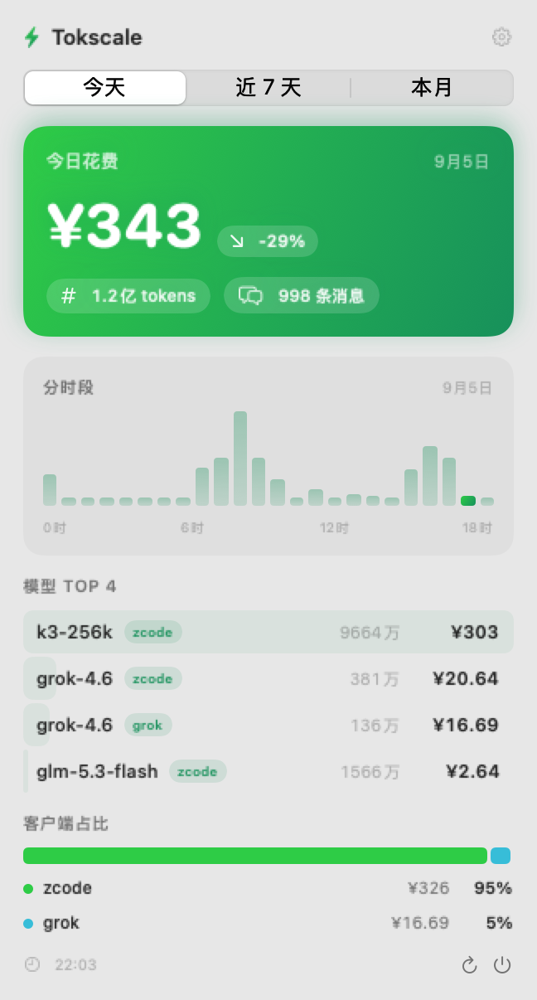
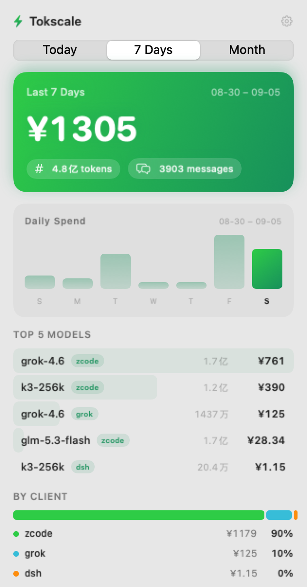

# TokscaleBar

[English](#english) · [中文](#中文)

<a id="english"></a>
## TokscaleBar (English)

A lightweight macOS menu bar app that turns your local [tokscale](https://github.com/tokscale/tokscale) CLI data into a live AI-usage dashboard. No accounts, no cloud — everything is read from the local `tokscale` binary and stays on your Mac.




### Features

- **Menu bar number**: today's spend (switchable to tokens / messages)
- **Rich popover dashboard** with three period tabs (Today / 7 Days / Month):
  - Gradient hero card with spend, token & message pills, and a day-over-day delta badge
  - Today → 24-hour bar chart with the current hour highlighted
  - 7 Days → daily bar chart with today highlighted
  - Month → smoothed daily area chart
  - Top-5 model breakdown (model, client, tokens, cost, relative-share bar)
  - Client share: stacked proportion bar with legend
- **Bilingual UI**: 中文 / English switcher (follows system by default)
- **Currencies**: USD `$` / CNY `¥` with a configurable exchange rate
- **Number units**: Western `K/M/B` or Chinese `千/万/亿`
- **Settings**: menu bar metric, refresh interval (1/5/15 min), launch at login, custom tokscale path

### Requirements

- macOS 13+
- [tokscale](https://github.com/tokscale/tokscale) CLI installed (`brew install tokscale` or see its repo); auto-detected in `/opt/homebrew/bin` and `/usr/local/bin`
- Xcode command line tools (Swift 5.9+) to build

### Download

Grab the latest release from [Releases](../../releases) — `TokscaleBar-*-macOS.dmg` (recommended, drag to Applications) or the plain `.zip` (universal binary, Apple Silicon + Intel). The app is ad-hoc signed, so on first launch either right-click → Open, or run `xattr -d com.apple.quarantine TokscaleBar.app`.

### Build & Run

```sh
./build-app.sh        # compile + bundle TokscaleBar.app (native arch)
open TokscaleBar.app  # launch (menu bar only, no Dock icon)
```

For development, `swift run` runs it in the foreground. Releases are built by GitHub Actions: push a `v*` tag and the Release workflow builds a universal binary, packages the zip, and publishes it with generated notes.

### Debug flags

- `--preview-window` — show the popover content in a regular window
- `--render-png <path> [--period today|week|month] [--lang zh|en] [--units western|chinese]` — render the dashboard offscreen to a PNG (used to generate the screenshots above)

### How it works

Pure AppKit + SwiftUI, zero third-party dependencies. The app spawns the local
`tokscale` CLI (`--json --today/--week/--month`, `hourly --json --today`, `graph`)
concurrently via `Process`, decodes the JSON, and refreshes on a timer.
All data stays local.

---

<a id="中文"></a>
## TokscaleBar（中文）

一个住在 macOS 菜单栏里的 tokscale 用量监视器。数据全部来自本机 tokscale CLI，不上传、不需要账号。

### 功能

- **菜单栏实时数字**：今日花费（可切换为 Tokens / 消息数）
- **丰富仪表盘**，三个时段页签（今天 / 近 7 天 / 本月）：
  - 渐变花费大卡片（Tokens、消息数胶囊，今日附「较昨日」涨跌）
  - 今天 → 24 小时分时段柱状图（当前小时高亮）
  - 近 7 天 → 每日柱状图（今天高亮）
  - 本月 → 每日花费平滑面积图
  - 模型 TOP 5 明细（模型、客户端、Tokens、费用、占比底条）
  - 客户端占比堆叠条 + 图例
- **中英双语**：设置里一键切换 中文 / English（默认跟随系统）
- **货币**：美元 `$` / 人民币 `¥`，汇率可自定义（默认 7.2）
- **数字单位**：英制 `K/M/B` 或 中制 `千/万/亿`
- **自定义设置**：菜单栏显示内容、刷新间隔（1/5/15 分钟）、登录时启动、tokscale 路径

### 下载

到 [Releases](../../releases) 下载最新版本——推荐 `TokscaleBar-*-macOS.dmg`（打开后拖进「应用程序」），也有 `.zip` 可选（通用二进制，同时支持 Apple Silicon 和 Intel）。应用是 ad-hoc 签名，首次打开请右键 → 打开，或执行 `xattr -d com.apple.quarantine TokscaleBar.app`。

### 构建与运行

需要 macOS 13+、Xcode 命令行工具，以及已安装的 [tokscale](https://github.com/tokscale/tokscale) CLI。

```sh
./build-app.sh        # 编译并打包 TokscaleBar.app（本机架构）
open TokscaleBar.app  # 启动（无 Dock 图标，只看菜单栏）
```

发布由 GitHub Actions 自动完成：推送 `v*` 标签即可触发 Release 工作流，自动构建通用二进制、打包 zip 并发布 Release。

### 文件结构

```
Package.swift                     SPM 包定义
Info.plist                        App 配置（LSUIElement = 无 Dock 图标）
build-app.sh                      一键打包脚本
docs/screenshots/                 README 截图
Sources/TokscaleBar/
├── main.swift                    入口、AppDelegate、状态栏与定时刷新
├── Tokscale.swift                tokscale 并发抓取、JSON 模型、数字格式化
├── Settings.swift                用户设置（UserDefaults + 登录项）
├── L10n.swift                    中英双语文案与语言/单位/货币枚举
├── Charts.swift                  柱状图、面积图、客户端占比组件
└── PopoverView.swift             仪表盘（时段页签）与设置界面
```

## License

MIT
